<p align="center">
  <picture>
    <source media="(prefers-color-scheme: dark)" srcset="docs/assets/readme/cabecera-dark.svg">
    
  </picture>
</p>

<p align="center">
  <b>¿Se puede compartir un ensayo clínico sin compartir a sus pacientes? Bioestadística para comprobar si las conclusiones médicas sobreviven y ataques reales para comprobar si los pacientes siguen protegidos.</b>
</p>

<p align="center">
  <a href="site/index.html"></a>
</p>

<p align="center">
  
  <a href="LICENSE"></a>
  
  
  
  
</p>

<p align="center">
  <picture>
    <source media="(prefers-color-scheme: dark)" srcset="docs/assets/readme/cifras-dark.svg">
    
  </picture>
</p>

<p align="center">
  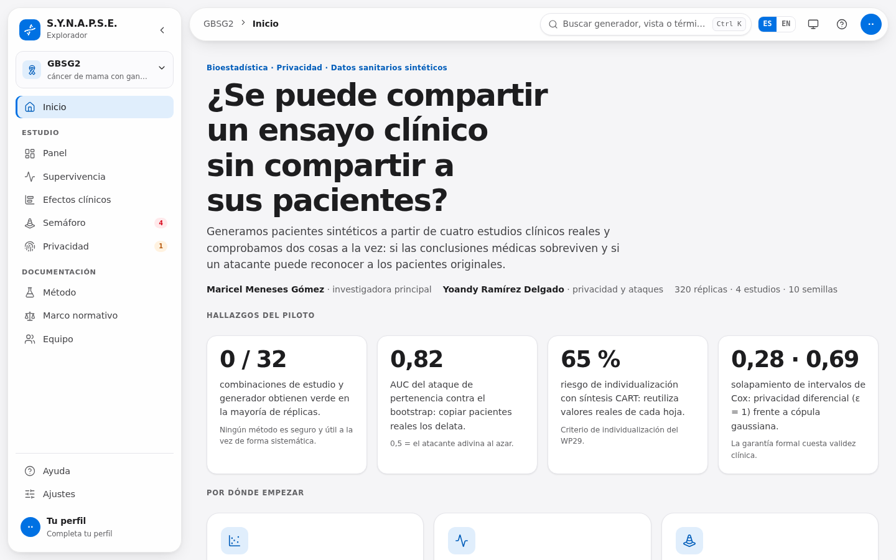
</p>

El **Espacio Europeo de Datos de Salud** (Reglamento (UE) 2025/327) y la investigación clínica necesitan compartir datos de pacientes, y el **RGPD** protege los datos de salud como categoría especial. Los datos sintéticos se presentan como la solución, casi siempre con un supuesto que nadie comprueba: *si es sintético, es anónimo y sirve igual*.

S.Y.N.A.P.S.E. pone a prueba ese supuesto con dos preguntas que se responden por separado y se juzgan a la vez:

- **¿Sobreviven las conclusiones clínicas?** Se mide con la **validez inferencial**: curvas de Kaplan-Meier, intervalos de los *hazard ratios* de Cox y efectos clínicos que cambian de signo o pierden la significación.
- **¿Siguen protegidos los pacientes?** Se mide con el **riesgo de reidentificación**: ataques de pertenencia y los tres criterios de anonimización del Grupo del Artículo 29.

El resultado es un **semáforo de liberación** con base normativa: verde, ámbar o rojo, con sus motivos.

<div align="center">

## `$ cat synapse.yaml`

<table>
  <thead>
    <tr>
      <th colspan="2" align="left"><code>synapse:~$ cat synapse.yaml</code></th>
    </tr>
  </thead>
  <tbody>
    <tr>
      <td width="50%" valign="top"><code>├─ bioestadistica:</code><br><br>
        
        
        
        
        
        <br>
        <sub><code>KM · RMST · log-rank · Cox · Karr 2006 · Raab 2016 · Snoke 2018 · índice C · Brier</code></sub>
      </td>
      <td width="50%" valign="top"><code>├─ privacidad:</code><br><br>
        
        
        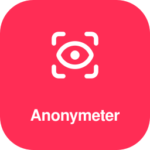
        <br>
        <sub><code>pertenencia (distancia y densidad) · individualización · vinculación · inferencia · ε</code></sub>
      </td>
    </tr>
    <tr>
      <td valign="top"><code>├─ datos:</code><br><br>
        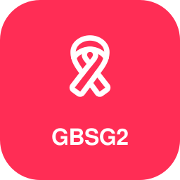
        
        
        <br>
        <sub><code>cáncer de mama · infarto · Clínica Mayo · cáncer de pulmón · públicos</code></sub>
      </td>
      <td valign="top"><code>├─ codigo:</code><br><br>
        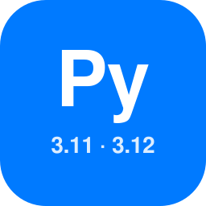
        
        
        
        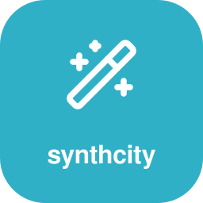<br>
        <sub><code>generadores propios · synthcity opcional (CTGAN, TVAE, PrivBayes, AIM)</code></sub>
      </td>
    </tr>
    <tr>
      <td valign="top"><code>├─ pruebas:</code><br><br>
        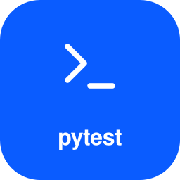
        
        
        <br>
        <sub><code>79 pruebas · 5 cuadernos ejecutables · cobertura ≥ 90 % · mypy · ruff</code></sub>
      </td>
      <td valign="top"><code>╰─ normativa:</code><br><br>
        
        
        
        <br>
        <sub><code>RGPD cdo. 26 · WP216 · EHDS · ISO/IEC 27559 · CI en cada cambio</code></sub>
      </td>
    </tr>
  </tbody>
  <tfoot>
    <tr>
      <td colspan="2"><code>version: 0.1.0&nbsp;&nbsp;·&nbsp;&nbsp;estudios: 4&nbsp;&nbsp;·&nbsp;&nbsp;réplicas: 320&nbsp;&nbsp;·&nbsp;&nbsp;idiomas: es, en&nbsp;&nbsp;·&nbsp;&nbsp;licencia: MIT</code></td>
    </tr>
  </tfoot>
</table>

</div>

---

## Índice

- [Cómo funciona](#-cómo-funciona)
- [Mapa mental](#-mapa-mental)
- [Hallazgos del estudio piloto](#-hallazgos-del-estudio-piloto)
- [El explorador](#-el-explorador)
- [Capturas](#-capturas)
- [Arranque rápido](#-arranque-rápido)
- [Calidad](#-calidad)
- [Ética y privacidad](#-ética-y-privacidad)
- [Estructura](#-estructura)
- [Limitaciones](#-limitaciones)
- [Documentación](#-documentación)
- [Licencia y cita](#-licencia-y-cita)
- [Equipo](#-equipo)

---

##  Cómo funciona

1. **Partición.** Los pacientes reales de cada estudio se dividen al azar, estratificando por evento: la mitad entrena al generador (los **miembros**) y la otra mitad no la ve nunca (el **control**).
2. **Síntesis.** Cada generador produce cinco conjuntos sintéticos del mismo tamaño que el entrenamiento.
3. **Validez inferencial.** Se repite el análisis clínico con los sintéticos y se compara con el real: curvas de Kaplan-Meier y su supervivencia media restringida, *hazard ratios* de Cox con el solapamiento de sus intervalos, y **conclusiones cambiadas**, es decir, efectos significativos que se pierden o cambian de signo. Los cinco sintéticos se combinan con las reglas de la imputación múltiple.
4. **Ataques.** Se intenta usar los sintéticos contra los pacientes reales. Solo cuenta como fuga el acierto que supera al obtenido sobre los pacientes de control.
5. **Veredicto.** Cada medida se califica en verde, ámbar o rojo con umbrales fijados de antemano. La privacidad manda: un rojo en privacidad significa «no liberar».
6. **Réplicas.** Todo se repite con diez semillas por estudio y generador, y se informa de la media con su error Monte Carlo.

##  Mapa mental

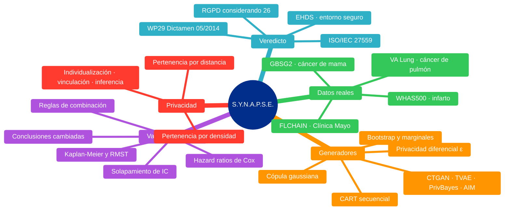
```mermaid
%%{init: {"theme": "base", "themeVariables": {"fontFamily": "-apple-system, BlinkMacSystemFont, Segoe UI, Helvetica, Arial, sans-serif", "primaryColor": "#0A5CFF", "primaryTextColor": "#FFFFFF", "lineColor": "#8E8E93", "cScale0": "#0A5CFF", "cScale1": "#34C759", "cScale2": "#FF9500", "cScale3": "#AF52DE", "cScale4": "#FF3B30", "cScale5": "#30B0C7", "cScaleLabel0": "#FFFFFF", "cScaleLabel1": "#FFFFFF", "cScaleLabel2": "#FFFFFF", "cScaleLabel3": "#FFFFFF", "cScaleLabel4": "#FFFFFF", "cScaleLabel5": "#FFFFFF"}}}%%
mindmap
  root((S.Y.N.A.P.S.E.))
    Datos reales
      GBSG2 · cáncer de mama
      WHAS500 · infarto
      FLCHAIN · Clínica Mayo
      VA Lung · cáncer de pulmón
    Generadores
      Bootstrap y marginales
      Cópula gaussiana
      CART secuencial
      Privacidad diferencial ε
      CTGAN · TVAE · PrivBayes · AIM
    Validez inferencial
      Kaplan-Meier y RMST
      Hazard ratios de Cox
      Solapamiento de IC
      Conclusiones cambiadas
      Reglas de combinación
    Privacidad
      Pertenencia por distancia
      Pertenencia por densidad
      Individualización · vinculación · inferencia
    Veredicto
      RGPD considerando 26
      WP29 Dictamen 05/2014
      EHDS · entorno seguro
      ISO/IEC 27559
```

##  Hallazgos del estudio piloto

**4 estudios clínicos × 8 generadores × 10 réplicas = 320 evaluaciones completas.**

<p align="center">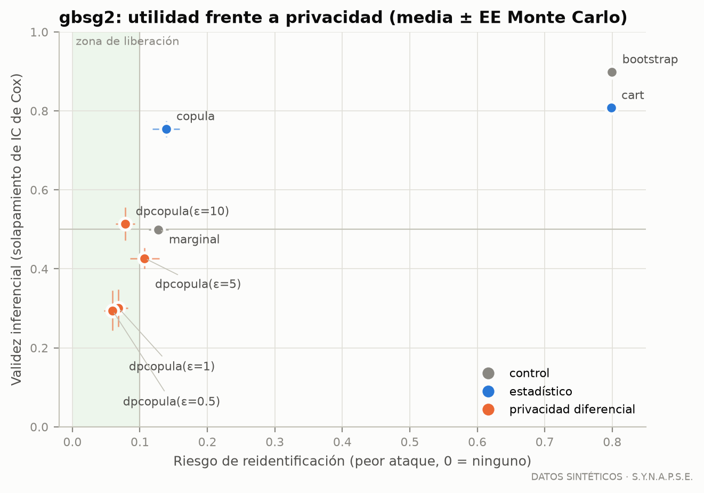</p>

- **Ningún generador es útil y seguro a la vez de forma sistemática.** Solo **2 de 320** réplicas superan todos los umbrales.
- **La utilidad se paga en privacidad.** El *bootstrap* conserva los efectos de Cox (solapamiento de IC de **0,86**), pero un ataque de pertenencia lo detecta con **AUC 0,82**. La síntesis CART conserva bien los efectos (**0,73**) y su riesgo de individualización llega a **0,74–0,80**.
- **La privacidad diferencial cuesta validez clínica.** Con **ε ≤ 1**, el solapamiento de IC cae a **0,24–0,30**: el modelo de Cox deja de decir lo mismo.
- **La cópula gaussiana es el mejor compromiso, pero no es inocua.** En GBSG2 puede borrar el efecto protector de la hormonoterapia, el resultado principal del ensayo.
- **Hallazgo metodológico.** Hasta remuestrear pacientes reales cambia **0,55** conclusiones por réplica. Exigir «cero conclusiones cambiadas» a un único sintético es demasiado estricto, y el preregistro lo corrige.

<table>
<tr>
<td width="50%">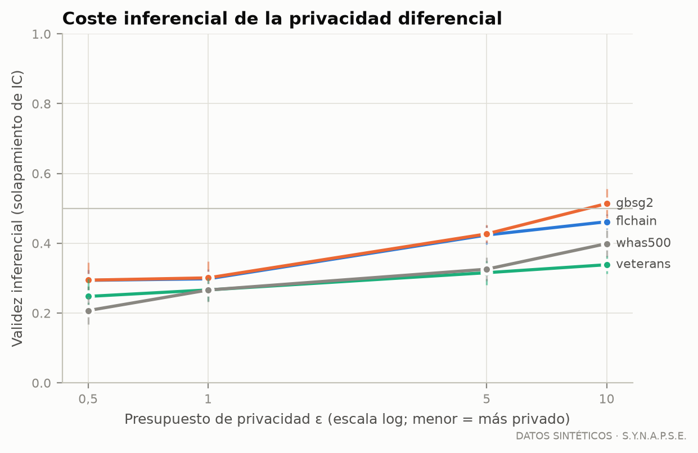<br/><sub><b>Privacidad diferencial</b> · validez inferencial frente a ε</sub></td>
<td width="50%">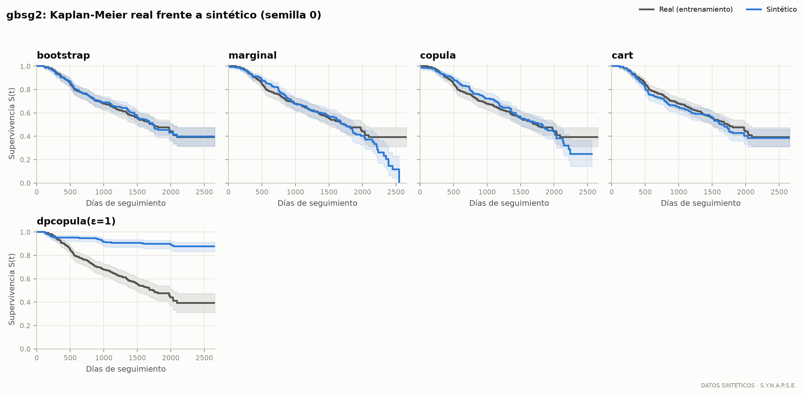<br/><sub><b>Kaplan-Meier</b> · real frente a cada generador (GBSG2)</sub></td>
</tr>
<tr>
<td colspan="2">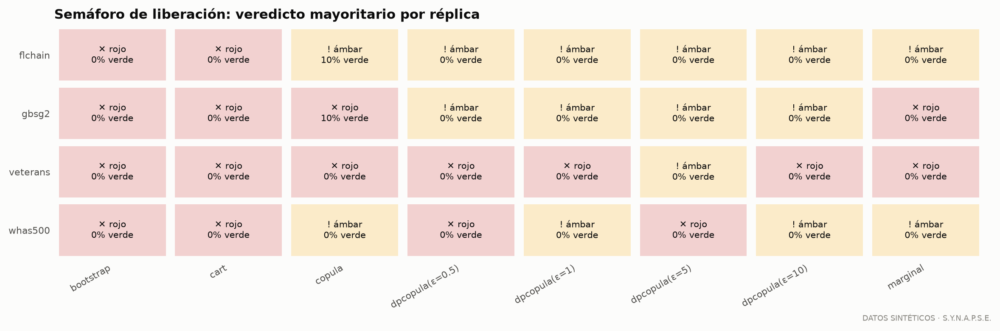<br/><sub><b>Semáforo</b> · veredicto mayoritario por estudio y generador</sub></td>
</tr>
</table>

> Resultados **exploratorios**. Las hipótesis confirmatorias se preregistran ([paper/preregistro_OSF.md](paper/preregistro_OSF.md)) y se contrastarán con semillas distintas.

##  El explorador

Una aplicación web en **un único fichero HTML**: sin servidor, sin instalar nada y sin ninguna petición de red.

| | Vista | Contenido |
|:-:|---|---|
|  | **Panel** | Pacientes, eventos, mejor compromiso, frente utilidad-privacidad interactivo y ficha del generador con su error Monte Carlo. |
|  | **Supervivencia** | Kaplan-Meier real frente a sintético, con cursor que da la supervivencia día a día. |
|  | **Efectos clínicos** | *Forest plot* de los *hazard ratios* de Cox, con los efectos cuya conclusión cambia marcados en rojo. |
|  | **Semáforo** | Veredicto por generador con validez, ataques y porcentaje de réplicas en verde. |
|  | **Método, marco normativo y equipo** | Cómo se mide, qué dice cada norma y quién hace qué. |

Además: búsqueda con `Ctrl + K`, barra lateral plegable con `[`, cambio de estudio con las teclas `1` a `4`, ayuda con glosario, ajustes de tema, acento, densidad y movimiento, perfil local, interfaz en español e inglés, y modos claro y oscuro.

```bash
synapse site      # → site/index.html: ábrelo con doble clic o publícalo en GitHub Pages
```

##  Capturas

<table>
<tr>
<td width="50%">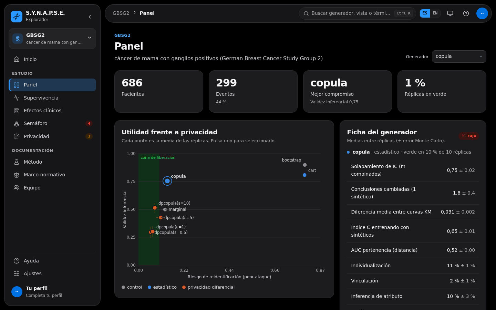<br/><sub><b>Panel</b> · frente utilidad-privacidad y ficha del generador</sub></td>
<td width="50%">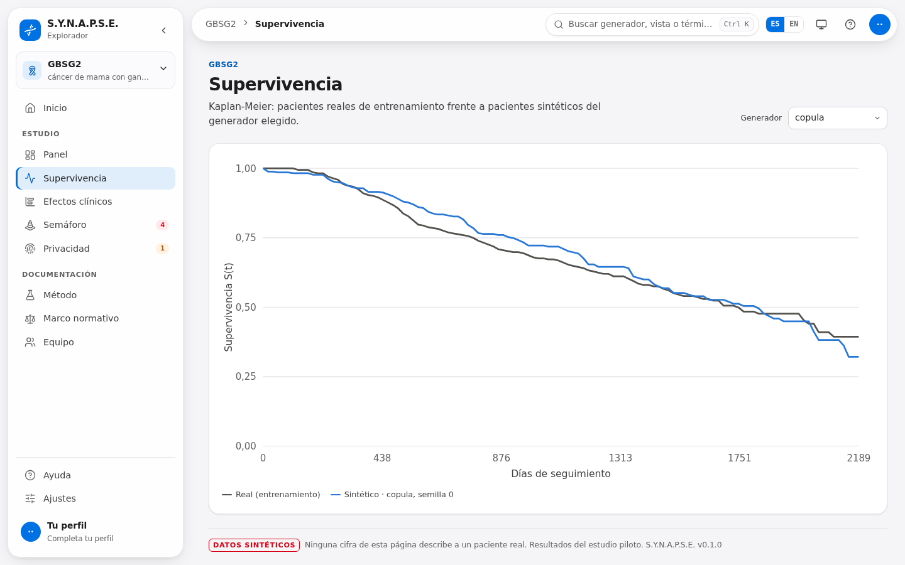<br/><sub><b>Supervivencia</b> · Kaplan-Meier real frente a sintético</sub></td>
</tr>
<tr>
<td>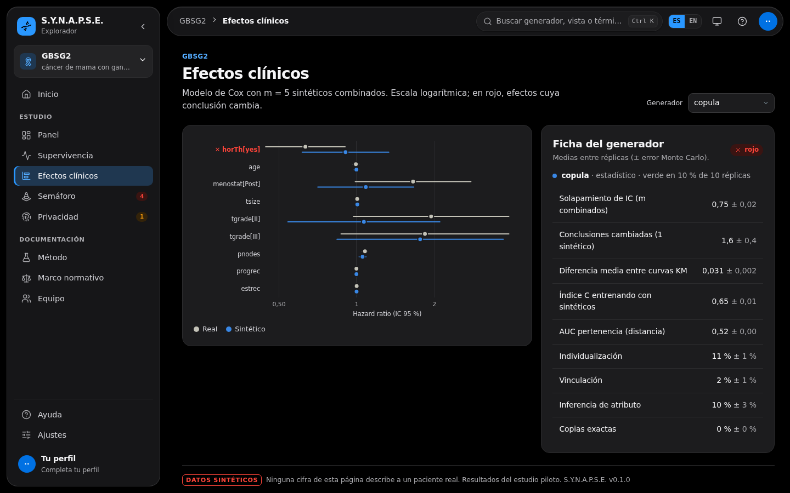<br/><sub><b>Efectos clínicos</b> · el efecto de la hormonoterapia, en rojo, cambia de conclusión</sub></td>
<td>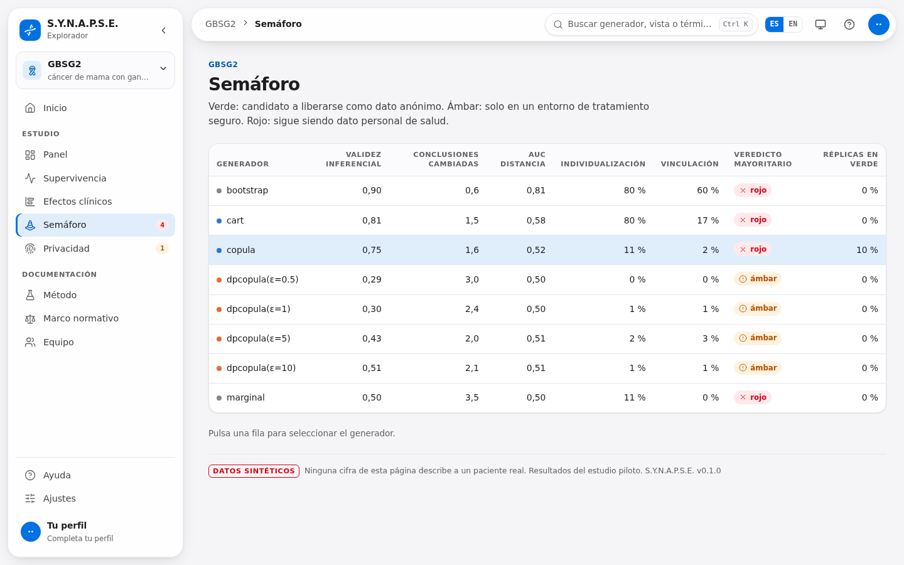<br/><sub><b>Semáforo</b> · veredicto y motivos por generador</sub></td>
</tr>
<tr>
<td>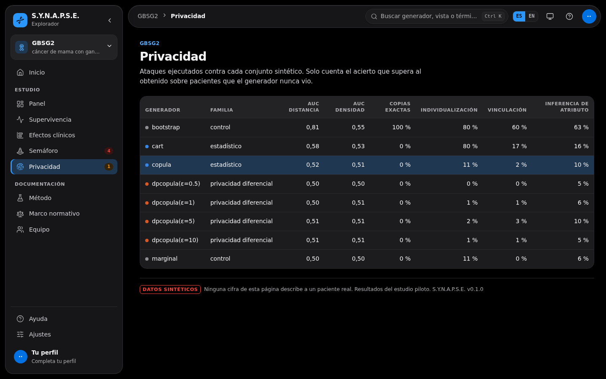<br/><sub><b>Privacidad</b> · resultado de cada ataque</sub></td>
<td>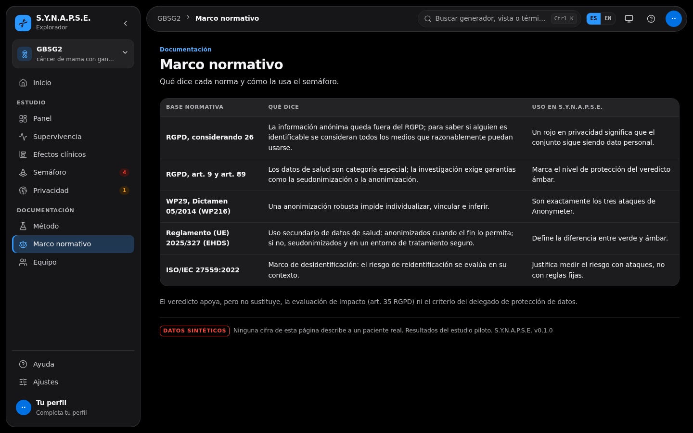<br/><sub><b>Marco normativo</b> · RGPD, WP29, EHDS e ISO/IEC 27559</sub></td>
</tr>
<tr>
<td>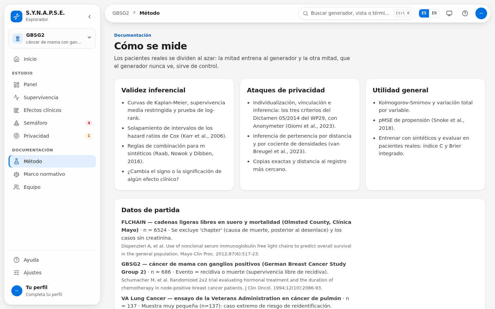<br/><sub><b>Método</b> · validez inferencial, ataques y datos de partida</sub></td>
<td>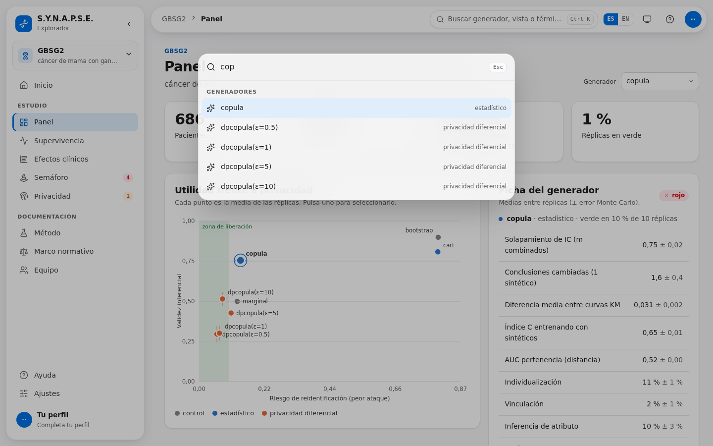<br/><sub><b>Búsqueda</b> · vistas, estudios, generadores y términos con Ctrl + K</sub></td>
</tr>
<tr>
<td>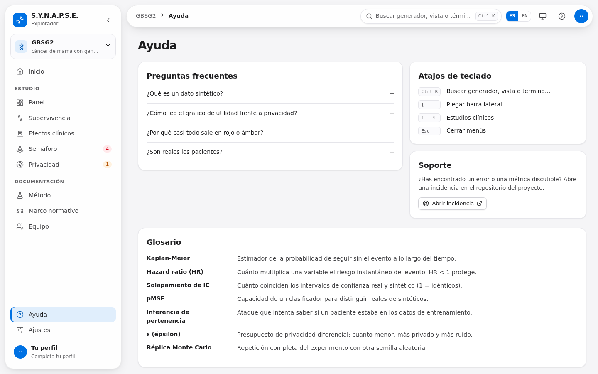<br/><sub><b>Ayuda</b> · preguntas frecuentes, glosario, atajos y soporte</sub></td>
<td>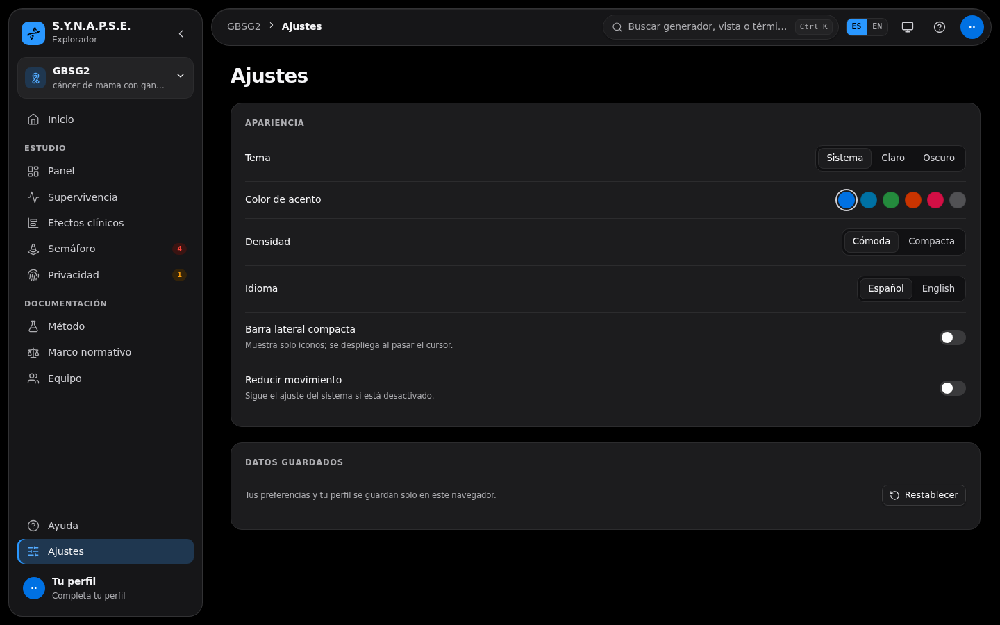<br/><sub><b>Ajustes</b> · tema, acento, densidad, idioma y movimiento</sub></td>
</tr>
</table>

**Barra lateral.** Flota separada de los bordes y se pliega con el botón o con `[`. Plegada, se despliega por encima del contenido al pasar el ratón.

<table>
<tr>
<td align="center" width="33%">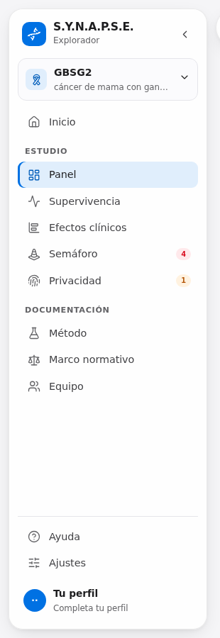<br/><sub>Completa</sub></td>
<td align="center" width="33%">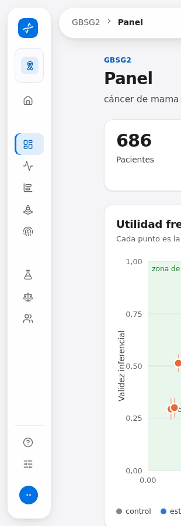<br/><sub>Compacta</sub></td>
<td align="center" width="33%">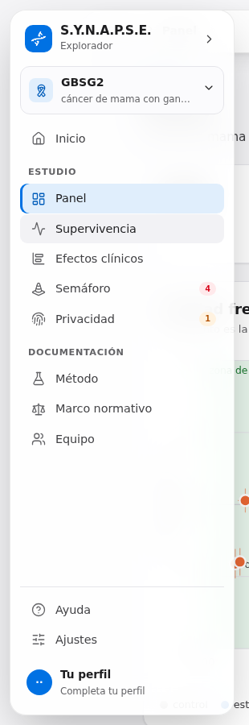<br/><sub>Compacta, al pasar el ratón</sub></td>
</tr>
</table>

**Móvil.** Por debajo de 900 px, la barra lateral pasa a ser un cajón y las tablas se desplazan dentro de su tarjeta.

<table>
<tr>
<td align="center" width="33%">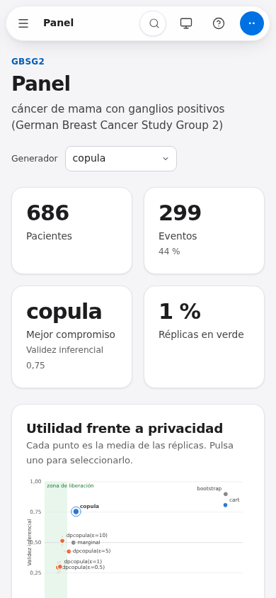</td>
<td align="center" width="33%">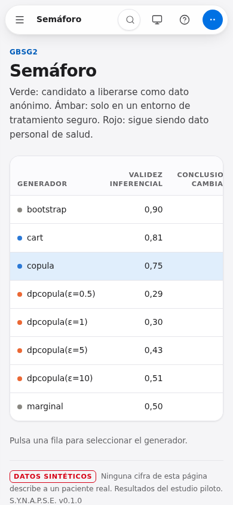</td>
<td align="center" width="33%">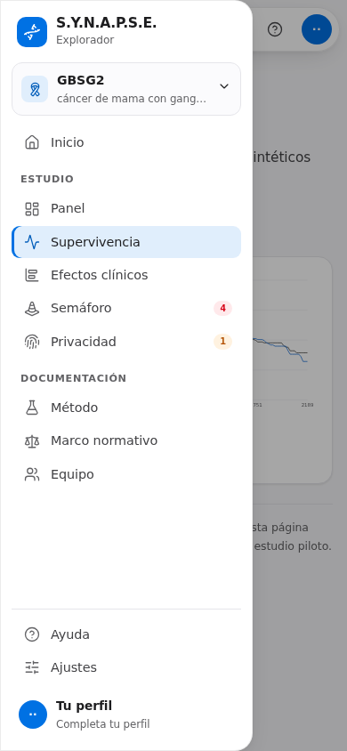</td>
</tr>
</table>

##  Arranque rápido

```bash
git clone https://github.com/maricelmeneses/synapse.git && cd synapse
python -m venv .venv && source .venv/bin/activate        # Windows: .venv\Scripts\activate
pip install -e ".[dev,dash]"

synapse datasets                                           # los 4 estudios clínicos
synapse evaluate gbsg2 copula --report informe.html        # una evaluación con su informe de liberación
synapse study --seeds 10 --workers 4                       # el estudio piloto completo (~5 min)
synapse figures                                            # las figuras del paper
streamlit run app/dashboard.py                             # evalúa TU propio CSV, sin salir de tu ordenador
```

<details>
<summary><b>Desarrollo</b>: generadores profundos, cuadernos, capturas y gráficos del README</summary>

```bash
# Generadores de aprendizaje profundo (synthcity; probado con Python 3.11)
pip install -e ".[deep]"
synapse study --deep --seeds 10

# Todas las comprobaciones de la CI
make all                                  # ruff + mypy + pytest con cobertura ≥ 90 %
python -m pytest --nbmake notebooks       # los 5 cuadernos se ejecutan de principio a fin

# Regenerar cuadernos, capturas y gráficos del README
python scripts/build_notebooks.py
synapse site && python scripts/capturas.py
python scripts/readme_assets.py
```

</details>

##  Calidad

| Suite | Herramienta | Comprobaciones | Qué demuestra |
|---|---|---|---|
| Datos | pytest | 7 | Tamaños y eventos publicados de los 4 estudios, partición estratificada y reproducible, exclusión de la fuga del desenlace en FLCHAIN. |
| Generadores | pytest + hypothesis | 29 | Esquema, tipos y rangos en cada sintético; reproducibilidad por semilla; la cópula conserva las correlaciones (error < 0,1); más ε da menos ruido; propiedades de la matriz de correlación. |
| Inferencia | pytest | 12 | **El Cox reproduce el HR publicado de la hormonoterapia en GBSG2 (0,71)**; valores conocidos del solapamiento de IC; las reglas de combinación ensanchan el intervalo exactamente T = v̄(1 + 1/m). |
| Privacidad | pytest | 17 | **Verdad conocida:** el *bootstrap* tiene que caer en todos los ataques y los marginales en ninguno; secretos raros excluidos; **reproducibilidad bit a bit** de toda una evaluación. |
| Aplicación | pytest + Typer | 9 | CLI completa, informe de liberación, figuras y explorador autocontenido, sin recursos externos. |
| Cuadernos | nbmake | 5 | Los cinco cuadernos de análisis se ejecutan de principio a fin en la CI. |

##  Ética y privacidad

- **Solo datos públicos.** Los cuatro estudios son clásicos de la bioestadística y se distribuyen con `scikit-survival`.
- **Ataques con propósito de evaluación.** Se lanzan solo contra sintéticos generados por el propio equipo. Nunca se intenta identificar a nadie fuera de este marco.
- **Honestidad del dato.** Cada figura, informe y vista lleva la marca **DATOS SINTÉTICOS**. Cada umbral está documentado como propuesta del equipo, no como estándar legal.
- **Todo en local.** El panel de Streamlit evalúa un CSV propio sin que el dato salga de la máquina, y el explorador no hace ninguna petición de red.
- **El veredicto no sustituye** a la evaluación de impacto (art. 35 RGPD) ni al criterio del delegado de protección de datos.

##  Estructura

```
synapse/
├── src/synapse/
│   ├── datasets.py          GBSG2 · WHAS500 · FLCHAIN · VA Lung, con esquema y límites públicos
│   ├── generators/          bootstrap · marginal · cópula · CART · cópula con privacidad diferencial · synthcity
│   ├── inference.py         Kaplan-Meier, Cox, solapamiento de IC, reglas de combinación
│   ├── utility.py           KS/TVD, asociaciones, pMSE, TSTR (índice C y Brier integrado)
│   ├── privacy.py           DCR, pertenencia (distancia y densidad), Anonymeter (WP29)
│   ├── compliance.py        semáforo → RGPD, WP216, EHDS, ISO/IEC 27559
│   ├── experiment.py        rejilla estudio × generador × semilla, en paralelo
│   ├── viz.py · report.py   figuras del paper e informe de liberación
│   ├── site.py              explorador web autocontenido
│   └── config/study.yaml    diseño del estudio y umbrales del semáforo
├── notebooks/               01 datos · 02 generadores · 03 validez inferencial · 04 privacidad · 05 síntesis
├── paper/                   borrador IMRaD (Quarto), preregistro OSF y bibliografía
├── results/                 métricas por réplica, términos de Cox y figuras del piloto
├── site/index.html          el explorador, listo para GitHub Pages
├── app/dashboard.py         panel Streamlit para evaluar un CSV propio
├── docs/                    metodología · ataques · marco legal · guía de la IP · difusión · migración
└── scripts/                 cuadernos, capturas, gráficos del README y publicación en GitHub
```

##  Limitaciones

- **Estudio piloto.** Diez réplicas por combinación; el estudio confirmatorio usará las semillas y los umbrales preregistrados.
- **Cuatro estudios de tamaño moderado** (de 137 a 2.000 pacientes en el análisis). Los resultados pueden cambiar con registros clínicos grandes como MIMIC-IV.
- **Atacante sin acceso al generador.** Solo ve los datos publicados. Un atacante con acceso al modelo sería más fuerte.
- **Umbrales propuestos por el equipo.** Ninguna norma fija hoy un valor numérico de riesgo aceptable.
- **Generadores profundos** disponibles como extra opcional; su inclusión en el estudio completo queda para la fase confirmatoria.

##  Documentación

| Documento | Para qué |
|---|---|
| [docs/metodologia.md](docs/metodologia.md) | Protocolo, generadores y decisiones de diseño |
| [docs/ataques_privacidad.md](docs/ataques_privacidad.md) | Modelo de amenaza, ataques y artefactos detectados en el piloto |
| [docs/marco_legal.md](docs/marco_legal.md) | Qué dice cada norma y cómo la usa el semáforo |
| [docs/guia_maricel.md](docs/guia_maricel.md) | Guía de la investigadora principal: qué decidir y cómo ejecutar |
| [paper/paper.qmd](paper/paper.qmd) · [preregistro](paper/preregistro_OSF.md) | Borrador del artículo y preregistro |
| [docs/difusion_linkedin.md](docs/difusion_linkedin.md) | Cinco publicaciones para contar el proyecto |
| [docs/linea2_vulnerabilidades.md](docs/linea2_vulnerabilidades.md) | Línea futura: supervivencia de vulnerabilidades en hospitales |

##  Licencia y cita

[MIT](LICENSE) · © 2026 Maricel Meneses Gómez y Yoandy Ramírez Delgado. Iconos: [Lucide](https://lucide.dev) (ISC). Datos de partida: estudios clínicos públicos citados en [docs/metodologia.md](docs/metodologia.md).

```bibtex
@software{synapse2026,
  author  = {Meneses Gómez, Maricel and Ramírez Delgado, Yoandy},
  title   = {{S.Y.N.A.P.S.E.}: Statistical fidelity and security evaluation of synthetic health data},
  year    = {2026},
  url     = {https://github.com/maricelmeneses/synapse},
  version = {0.1.0}
}
```

##  Equipo

<table>
<tr>
<td align="center" width="50%" valign="top">
<br/>
<b>Maricel Meneses Gómez</b><br/>
<sub><b>Investigadora principal · Bioestadística y analítica de datos</b></sub><br/>
<sub>Lic. en Ciencias de la Computación · Máster en Computación Aplicada · IBM Data Analyst</sub><br/>
<sub>10 años de docencia universitaria en Computación y Estadística, 5 de ellos en la Universidad de Ciencias Médicas de Villa Clara</sub><br/><br/>
<a href="https://www.linkedin.com/in/maricel9002/"></a>
<a href="https://github.com/maricelmeneses"></a>
<br/><sub>Diseño del estudio · validez inferencial · análisis de supervivencia · redacción</sub>
</td>
<td align="center" width="50%" valign="top">
<br/>
<b>Yoandy Ramírez Delgado</b><br/>
<sub><b>Privacidad ofensiva · GRC · Ingeniería</b></sub><br/>
<sub>Junior Pentester · eJPTv2 · AI Governance (ISO 42001) · ENS · SysAdmin</sub><br/><br/>
<a href="https://www.linkedin.com/in/yoandyrd92/"></a>
<a href="https://github.com/heindall92"></a>
<a href="https://yoandyramirez.com"></a>
<br/><sub>Ataques de reidentificación · marco normativo · software · explorador</sub>
</td>
</tr>
</table>

Errores, métricas discutibles o propuestas: abre una [*issue*](https://github.com/maricelmeneses/synapse/issues).
