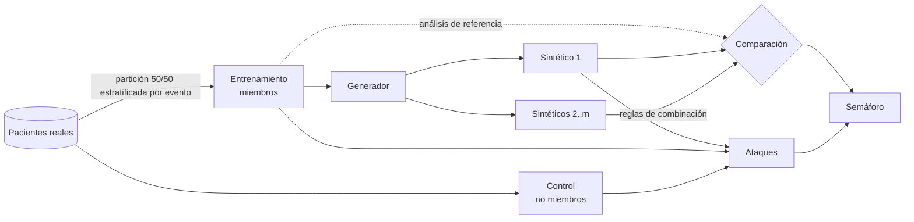

# Metodología

## Pregunta
¿Qué generadores de datos sintéticos conservan la **inferencia clínica** de un análisis de
supervivencia y a qué coste en **riesgo de reidentificación**?

## Protocolo de cada réplica

1. **Partición.** Los pacientes reales se dividen al azar, estratificando por evento, en
   entrenamiento (los ve el generador) y control (no los ve nunca).
2. **Síntesis.** El generador se ajusta con el entrenamiento y produce m = 5 conjuntos del mismo
   tamaño.
3. **Validez inferencial.** Se compara el análisis de los sintéticos con el del entrenamiento real:
   - curvas de Kaplan-Meier: distancia media absoluta en [0, τ], diferencia de RMST y log-rank, con
     τ igual al percentil 90 del seguimiento real;
   - modelo de Cox: solapamiento de IC por término (Karr et al., 2006), concordancia de signo y de
     significación, «conclusión cambiada» y diferencia estandarizada;
   - reglas de combinación para m sintéticos (Raab, Nowok y Dibben, 2016): T = v̄·(k/n + 1/m).
4. **Utilidad general.**
   - KS y distancia de variación total por variable.
   - Diferencia de matrices de asociación: ρ de Spearman, V de Cramér y η.
   - pMSE logístico y su cociente frente a la nula (Snoke et al., 2018).
   - TSTR frente a TRTR: índice C de Harrell y Brier integrado, con la censura estimada siempre con
     datos reales.
5. **Privacidad.** Ver [ataques_privacidad.md](ataques_privacidad.md).
6. **Veredicto.** Cada criterio se califica en verde, ámbar o rojo según `src/synapse/config/study.yaml`.
   El nivel de privacidad y el de utilidad son el peor de sus criterios, y el veredicto final los
   combina (ver `compliance.VERDICTS`).

## Generadores

| Nombre | Familia | Idea | Referencia |
|---|---|---|---|
| `bootstrap` | control | Copia filas reales con reemplazo (techo de utilidad, suelo de privacidad) | — |
| `marginal` | control | Cada columna por separado (techo de privacidad, suelo de utilidad) | — |
| `copula` | estadístico | Cópula gaussiana con transformación distribucional para discretas | Rüschendorf (2009) |
| `cart` | estadístico | Síntesis secuencial por árboles; donantes de hoja; desenlace al final | Nowok et al. (2016) |
| `dpcopula` | privacidad diferencial | Marginales y τ de Kendall con ruido de Laplace sobre límites públicos | Li et al. (2014) |
| `ctgan`, `tvae` | aprendizaje profundo | Redes generativas de synthcity | Xu et al. (2019) |
| `privbayes`, `aim` | privacidad diferencial | Red bayesiana y mecanismo adaptativo de synthcity | Zhang et al. (2017); McKenna et al. (2022) |

### Decisiones de diseño de `dpcopula`
- **Vecindad acotada:** se sustituye un registro y n es público.
- **Presupuesto:** ε/2 para marginales y ε/2 para correlaciones, repartido por igual entre columnas
  y entre pares.
- **Histogramas sobre límites públicos** (`Schema.bounds`), fijados *a priori* y no a partir del
  mínimo y el máximo observados, que filtrarían información.
- **Sensibilidades:** 2 para los histogramas y 4/n para la τ de Kendall con desempates aleatorios
  independientes de los datos.

## Datos

| Estudio | n | Eventos | Particularidad |
|---|---|---|---|
| GBSG2 | 686 | 299 | Ensayo aleatorizado; efecto protector conocido de la hormonoterapia |
| WHAS500 | 500 | 215 | 14 covariables, 8 binarias |
| FLCHAIN | 6.524 | 1.962 | Se excluye `chapter` (fuga del desenlace); casos completos de creatinina; submuestra de 2.000 |
| VA Lung | 137 | 128 | Caso extremo de muestra pequeña |

## Reproducibilidad
- `synapse study --seeds 10 --workers 4` reproduce el piloto bit a bit (semillas fijas en partición
  y generador).
- `results/tables/study_metrics.csv` guarda una fila por réplica, con todas las métricas y los
  parámetros del generador.
- `results/tables/study_terms.csv` guarda un término de Cox por fila (un solo sintético y m
  combinados).
- Los cuadernos `notebooks/0*.ipynb` se regeneran con `python scripts/build_notebooks.py`.
